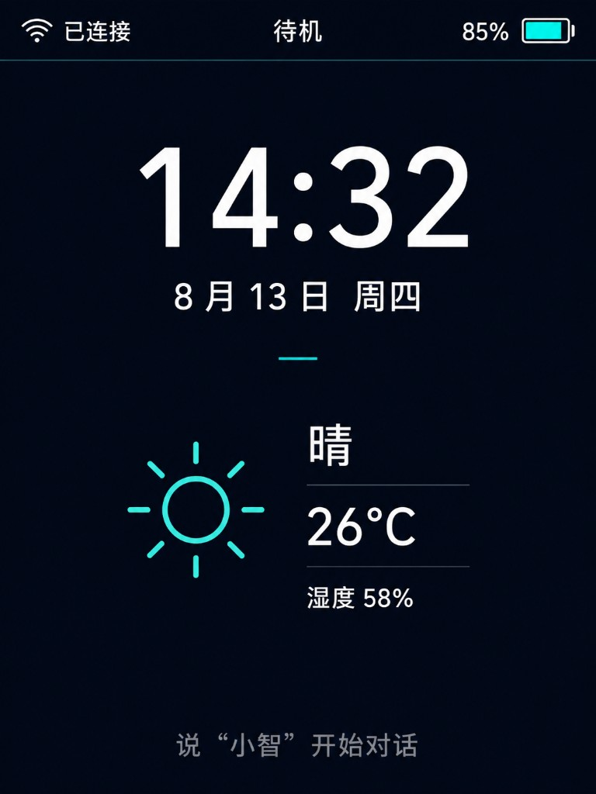

# Design: Portrait Idle Home UI (weather / clock / TH placeholders)

Date: 2026-08-13  
Branch: `feat/music-ha-mcp` (or follow-up UI branch)  
Status: approved for planning  
Mockup: `docs/superpowers/specs/assets/2026-08-13-idle-home-portrait-mockup.png`

## Problem

`my-voice-board` already uses stock `SpiLcdDisplay` LVGL UI (centered emoji + status + chat). For everyday use the carrier ST7789 should feel like a small desk appliance while **idle**: show time, date, weather, temperature, and humidity. Emoji should appear only when the user is in a **chat** session (listening / speaking), not as the idle face.

## Goals (phase 1)

1. **Portrait 240×320** logical UI for `my-voice-board` SPI LCD (change board orientation from current landscape IPS defaults).
2. **Idle home panel** matching the approved mockup:
   - Top status bar: network + device state + battery (best-effort)
   - Large clock + date
   - Weather icon + weather text + temperature + humidity
   - Bottom wake hint: `说“小智”开始对话`
3. **Chat mode**: hide home panel content (clock / weather block); show stock centered emoji + chat subtitle as today.
4. **Data**: placeholders only (`--`, `--°C`, `--%`). Provide a thin `SetHomeEnvironment(...)` API for a **future custom HTTP/API** the team will write; no live weather wiring in phase 1.
5. Optional but included if low-cost: **idle backlight dim** after 30s to 20% (non-persisted), restore on leave idle — same behavior as prior idle-home work on the custom fork.

## Non-goals (phase 1)

- Implementing the weather/TH HTTP client
- Home Assistant weather binding
- On-board TH sensor drivers
- Touch interaction
- Full screen redesign of WeChat / Emote message styles (home panel targets **default message style** path used by my-voice-board)
- Music lyrics panel
- Battery ADC if not already available (show icon / omit % if unknown)

## Visual reference

Approved mockup (portrait, dark + cyan accent):



| Token | Value (approximate) |
|--------|---------------------|
| Background | near `#0B1220` |
| Primary text | near white |
| Accent | cyan (~`#3DD6C6`, avoid pure `#00FFFF` if too harsh on panel) |
| Dim hint | muted gray |

## Layout

### Idle (`kDeviceStateIdle` after ready)

```
+----------------------+  240
| WiFi  待机     电池  |  top_bar_ (~28–32 px)
+----------------------+
|                      |
|       14:32          |  clock (largest font)
|   8月13日 周四        |  date
|        ——            |  accent rule
|                      |
|  [☀]   晴            |  weather row
|        26°C          |
|        湿度 58%      |
|                      |
| 说“小智”开始对话      |  wake hint
+----------------------+
                    320
```

Phase-1 placeholder strings when unset: weather `--`, temp `--°C`, humidity `湿度 --%` (or `|--`).

### Chat (`listening` / `speaking`, and connecting as needed)

- Hide `home_panel_` (clock + weather + wake hint).
- Show existing `emoji_box_` + bottom chat / status behavior from stock `LcdDisplay`.
- Keep top status bar.

## Approaches considered

1. **Extend `LcdDisplay` + `Application` state hooks** (chosen): reuses theme, status bar, emoji path; least duplication for one board family using default message style.
2. Board-only custom `Display` subclass: isolates risk but forks UI maintenance.
3. Full new screen manager: overkill for phase 1.

## Architecture

### Display API (`Display` / `LcdDisplay`)

Add no-op defaults on `Display`; implement on `LcdDisplay` (default-style `SetupUI` path):

```text
SetHomeVisible(bool visible)
SetHomeEnvironment(weather_text, temp_c_text, humidity_text, weather_icon_id_or_null)
SetHomeClock(time_text, date_text)   // or refresh from Application every minute
```

Widgets (names illustrative):

- `home_panel_`
- `home_time_label_`, `home_date_label_`
- `home_weather_icon_`, `home_weather_label_`
- `home_temp_label_`, `home_humidity_label_`
- `home_wake_hint_label_`

Clock font: use a larger builtin (e.g. `font_noto_sans_basic_30_4` / `40` if available in assets) for time only; body text keeps board default 16px-class font.

Weather icon: Material Symbols or a small static asset map (`sunny` / `cloudy` / `rain` / `unknown`); phase 1 can use one placeholder glyph.

### Application

- On enter **idle**: `SetHomeVisible(true)`; start clock refresh (1 Hz or 1/min for time, date at midnight); start optional 30s dim timer.
- On enter **listening / speaking**: `SetHomeVisible(false)`; ensure emoji path active; cancel dim; restore brightness.
- Do not fetch weather in phase 1. Optional: call `SetHomeEnvironment("--", "--°C", "湿度 --%", nullptr)` once at boot so UI is explicit.

### Board / orientation

- `my-voice-board` SPI config: logical **240×320**, `SWAP_XY` / mirror / invert set for upright portrait on the carrier panel (verify against physical mount; document the chosen Kconfig: prefer portrait profile even if panel is IPS).
- CMake fonts: keep readable Chinese font; add larger clock font dependency if not already pulled for this board.
- Build variant in `config.json` should select portrait-oriented sdkconfig flags.

### Future data hook (out of phase 1 code, interface only)

A later module (custom HTTP) will call:

`Board::GetInstance().GetDisplay()->SetHomeEnvironment(...)`

Contract: UTF-8 strings already formatted for the labels; display does not parse JSON. Refresh interval owned by the fetcher (e.g. 10–30 min), not the UI.

## Error handling

- Setters before `SetupUI` or on `NoDisplay`: no-op.
- Missing battery: omit percentage text; keep icon empty if `GetBatteryLevel` fails.
- Rapid idle↔chat: always cancel dim timer when leaving idle; never leave home panel covering emoji.

## Testing

1. Build/flash `my-voice-board` portrait SPI variant.
2. Idle: mockup-like layout with placeholders; clock ticks.
3. Wake / talk: home hidden; emoji + subtitle visible.
4. Return idle: home visible again.
5. (If dim implemented) ~30s idle → brightness ~20%; wake restores.
6. Soft-fail NoDisplay path still boots.

## Follow-ups

- Custom weather/TH HTTP client → `SetHomeEnvironment`
- Optional HA weather mapping
- Battery ADC for real %
- Longer idle → panel off
- Music now-playing strip

## Acceptance checklist

- [ ] Portrait 240×320 idle home matches mockup structure (not pixel-perfect)
- [ ] Placeholders for weather / temp / humidity
- [ ] Live clock + date from device time (NTP once online)
- [ ] Chat shows emoji; idle does not center emoji as primary
- [ ] No live weather network dependency in phase 1
- [ ] my-voice-board builds and runs on carrier ST7789
